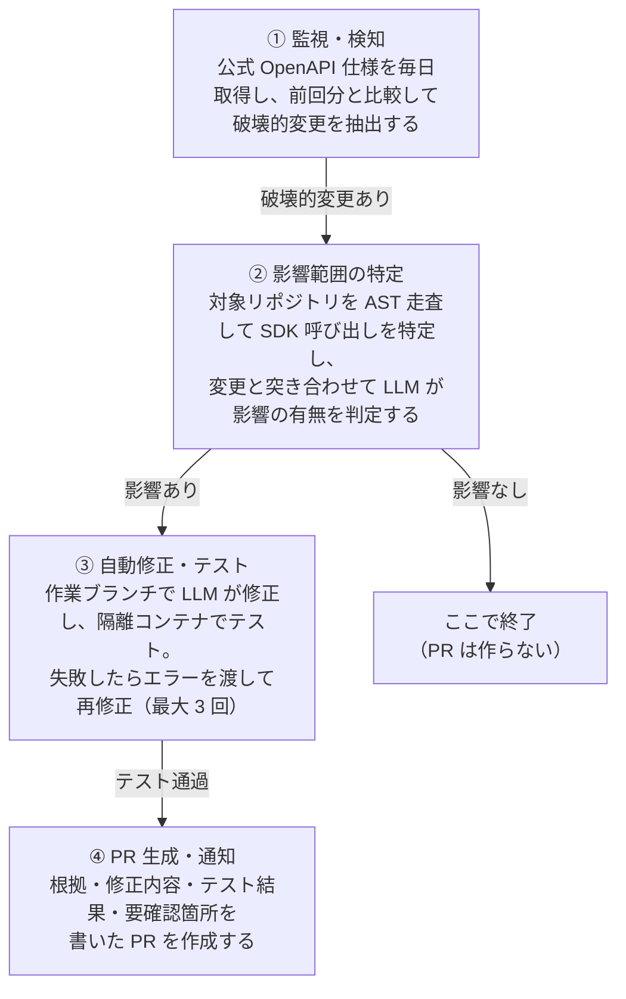
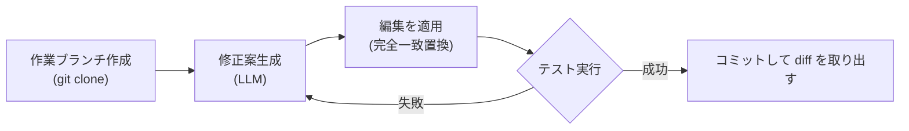

# API_update

**Stripe / OpenAI / Twilio / Slack の API 破壊的変更を検知し、影響を受けるコードを自動修正して Pull Request を出す GitHub App。**

---

## 解こうとしている問題

外部 API は予告なく壊れる。仕様変更のアナウンスは流れてくるが、
**「自分のコードのどこが壊れるのか」は誰も教えてくれない。**

結果、多くのチームはこうなる。

- Changelog を読む人がいない → 本番で初めて壊れたことに気づく
- 読んでも、全リポジトリを grep して影響を確認する時間がない
- 影響がないことの確認だけで半日溶ける

このシステムは、**仕様の差分とコードの AST を突き合わせて「本当に壊れる箇所」だけを特定し**、
修正案を作り、テストを通してから PR にする。

### 動作イメージ

Stripe が Checkout Session の `line_items` から `amount` / `name` / `currency` を削除した場合:

```diff
  const session = await stripe.checkout.sessions.create({
    line_items: [
      {
-       name: 'Pasha photo',
-       amount: 500,
-       currency: 'usd',
        quantity: 1,
+       price: 'price_xxx',
      },
    ],
  });
```

この修正と、下記を含む PR が自動で作られる。

- どの仕様変更を根拠にしたか（公式 Changelog へのリンク付き）
- どのファイルの何行目を、なぜ変えたのか
- テストが通ったかどうか（`12/12 passed` など実行結果）
- **自動では判断できなかった箇所の一覧**（レビュアーが見るべき場所）

## 全体の流れ



各モジュールは独立して起動でき、途中で止めても結果は DB に残る。
**影響がなければ ② で打ち切る**のがこの設計の要で、無駄な PR を出さないことを最優先にしている。

## 目次

| 節 | 内容 |
| --- | --- |
| [セットアップ](#セットアップ) | Docker だけで動かす |
| [① 監視・検知](#detector) | 仕様の取得と差分エンジン |
| [② 影響範囲の特定](#analyzer) | AST 走査と SDK 対応づけ |
| [③ 自動修正・テスト](#fixer) | 修正ループとサンドボックス |
| [④ PR 生成](#pr) | PR 概要欄と送信 |
| [Webhook / 通知](#webhook-受信) | PR のその後を追跡する |
| [HTTP エンドポイント](#endpoints) | API リファレンス |
| [再現テスト](#backtest) | 精度の測り方と結果 |
| [制限と既知の課題](#制限と既知の課題) | できないこと |
| [環境変数](#環境変数) | 設定一覧 |

設計方針の原文は [.claude/CLAUDE.md](.claude/CLAUDE.md)。

## 技術スタック

| 領域 | 採用技術 |
| --- | --- |
| 言語 / ランタイム | TypeScript / Node.js 22 (ESM) |
| HTTP サーバ | Fastify 5（GitHub Webhook 受信口） |
| 永続化 | PostgreSQL 17（スペックのスナップショット・実行ログ） |
| キュー / キャッシュ | Redis 7 |
| 実行環境 | Docker / Docker Compose |

## セットアップ

必要なのは **Docker と Docker Compose だけ**（Node.js / Python / Go はイメージに含まれる）。

```bash
git clone https://github.com/amaimono3216/API_update.git
cd API_update

# 最小構成の .env を作る（他の設定は「環境変数」を参照）
cat > .env <<'EOF'
DATABASE_URL=postgres://api_update:api_update@db:5432/api_update
REDIS_URL=redis://redis:6379
NODE_ENV=development
EOF

docker compose up -d --build
curl http://localhost:3000/health
```

正常なら次が返る。

```json
{"status":"ok","uptime":6,"dependencies":{"postgres":"ok","redis":"ok"}}
```

この状態で **① 監視・検知は動く**（無料）。
② の影響判定と ③ の自動修正には `ANTHROPIC_API_KEY`、
④ の PR 送信には GitHub App の認証情報が要る。未設定でも該当機能をスキップして動作する。

```bash
# 監視対象の仕様を初回取得（ベースライン作成）
curl -X POST http://localhost:3000/detect/stripe

# 精度の再現テストを回す（LLM を使わないので無料）
docker compose run --rm --no-deps app npx tsx src/scripts/backtest.ts
```

<a id="detector"></a>

## ① 監視・検知モジュール (Update Detector)

各サービスの公開 OpenAPI スペックを定期取得し、前回分との差分から破壊的変更を抽出する。

### 監視対象

| プロバイダ | 仕様 | SDK 呼び出し → パスの対応 |
| --- | --- | --- |
| Stripe | OpenAPI 3 | `stripe.checkout.sessions.create` → `/v1/checkout/sessions` |
| OpenAI | OpenAPI 3 (YAML) | `openai.chat.completions.create` → `/chat/completions` |
| Twilio | OpenAPI 3 | `client.messages.create` → `/2010-04-01/Accounts/{AccountSid}/Messages.json` |
| Slack | **Swagger 2.0** | `client.chat.postMessage` → `/chat.postMessage` |

対応言語は TypeScript / JavaScript・Python・Go。

対応づけの規則は SDK ごとに根本的に異なるため、[src/analyzer/sdk-map.ts](src/analyzer/sdk-map.ts) で
プロバイダごとに解決関数を持たせている。いずれも推測を含むため、生成した候補は
**必ず実スペックのパスと突き合わせて検証**する。

Slack は Swagger 2.0 のため、取得時に [src/detector/normalize.ts](src/detector/normalize.ts) で
OpenAPI 3 相当へ正規化する（`definitions` → `components.schemas`、`in: formData` → `requestBody` など）。
差分エンジン側は OpenAPI 3 だけを前提にできる。

> **対象外**: AWS は OpenAPI ではなく Smithy/botocore 形式（`operations` / `shapes`）のため別エンジンが必要。
> Shopify は REST が 2024/10 にレガシー化し GraphQL 移行中のため、追随対象としての価値が薄い。

| 手順 | 処理 | 補足 |
| --- | --- | --- |
| 1 | `fetchSpec` | 公式スペックを取得・パース |
| 2 | `saveSnapshot` | SHA-256 が前回と同一なら再保存しない |
| 3 | `diffOpenApi` | 新旧を比較して破壊的変更を抽出 |
| 4 | `saveDiff` | 差分を永続化。破壊的変更があれば ② へ |

- スケジュール: `DETECT_CRON`（既定 毎日 03:00 JST）。`DETECT_ENABLED=false` で無効化。
- 二重起動は Redis の分散ロックで防止する（cron と手動実行が重なった場合など）。
- 取得結果は `api_spec_snapshots`、差分は `api_spec_diffs` に保存される。

### 差分エンジン

仕様書にある `openapi-diff` CLI は使わず、[src/detector/](src/detector/) に自前実装している。
②③ の LLM プロンプトへそのまま渡せる構造化 JSON が必要なことと、
「変更されたスキーマ → それを参照している API 操作」の逆引きが CLI の出力からは作れないため。

判定の要点は **方向（request / response）によって結論が逆転する** こと。

| 変更 | リクエスト側 | レスポンス側 |
| --- | --- | --- |
| プロパティ削除 / 型変更 | breaking | breaking |
| 必須プロパティの追加 | breaking | 互換 |
| 必須の解除 | 互換 | breaking |
| enum 値の削除 | breaking | warning |
| enum 値の追加 | 互換 | warning |
| enum → 素の型（制約の解除） | **互換** | warning |
| 素の型 → enum（制約の追加） | breaking | warning |

最後の 2 行は再現テストで見つけた誤検知への対応。Twilio が `UsageCategory` を
enum から `string` に緩めたとき、単純に「型が変わった」と扱うと破壊的変更になり
不要な PR が出る。実際には既存の値はそのまま通るので、`$ref` の参照先を解決して
**基底型が同じなら緩和と判定する**ようにしている。

`$ref` は展開せず、同一参照なら等価とみなして打ち切る（循環参照とスキーマ爆発の回避）。
参照先の変更は `components.schemas` の差分として検出し、
[RefIndex](src/detector/ref-index.ts) が参照グラフを遡って影響する操作を特定する。

`POST /detect/:provider` の応答 `status` は次のいずれか。

| status | 意味 |
| --- | --- |
| `baseline` | 初回取得。比較対象がないため差分は取らない |
| `unchanged` | ハッシュ一致。API 側に変更なし |
| `compatible` | 差分はあるが後方互換。② 以降は起動しない |
| `breaking` | 破壊的変更を検知。② へ引き渡す |
| `locked` | 他プロセスが実行中（HTTP 409） |

### 動作確認

実際の API 変更を待たずに検証する場合は、過去バージョンをベースラインとして取り込む。

```bash
docker compose exec app npm run seed:baseline -- \
  stripe https://raw.githubusercontent.com/stripe/openapi/<sha>/openapi/spec3.json
curl -X POST http://localhost:3000/detect/stripe
```

<a id="analyzer"></a>

## ② 影響範囲特定モジュール (Impact Analyzer)

検知した破壊的変更が、対象リポジトリのコードに実際の影響を与えるかを判定する。
影響がなければここで終了し、③ 以降を起動しない（無駄な PR を防ぐ）。

| 手順 | 処理 | 何をするか |
| --- | --- | --- |
| 1 | リポジトリ走査 | 対象言語のソースファイルを列挙 |
| 2 | AST スキャン | SDK 呼び出しと、渡しているパラメータ名を抽出 |
| 3 | 突合 | 破壊的変更と、同じ操作を呼んでいる箇所を対応づけ |
| 4 | LLM 判定 | 影響あり / なし / 判断できず を確定 |
| 5 | 実行記録 | 判定結果と理由を DB に保存 |

### コード解析

[src/analyzer/scan.ts](src/analyzer/scan.ts) が拡張子で言語を振り分ける。

| 言語 | 解析方法 |
| --- | --- |
| TypeScript / JavaScript | [scan-typescript.ts](src/analyzer/scan-typescript.ts) — TypeScript Compiler API（同一プロセス内） |
| Python | [scan-python.ts](src/analyzer/scan-python.ts) — Python の `ast` モジュール（外部プロセス） |
| Go | [scan-go.ts](src/analyzer/scan-go.ts) — Go の `go/ast`（ビルド済みバイナリ） |

TypeScript 側は型チェッカを使わず単一ファイルのパースのみで完結させている。tsconfig や
node_modules の解決が不要になり、任意のリポジトリをそのまま走査できるため。

Python と Go はその言語自身のパーサに構文解析を任せる
（[extract_python_calls.py](src/analyzer/extract_python_calls.py) /
[tools/go-extract](tools/go-extract/main.go)）。文法を推測で再実装せずに済むため。
どちらも **SDK の知識は持たせず構文上の事実だけを返し**、対応づけは `sdk-map` に集約している。
全ファイルを 1 回のプロセス起動で処理する。

Go の解析器はビルド時にのみ Go ツールチェーンを使い、実行イメージには
**約 2.3MB のバイナリだけ**を置く（ツールチェーン全体なら約 500MB）。

いずれも精度は「解決したパスが実スペックに存在するか」で担保している。

検出できるクライアント定義:

```ts
const stripe = new Stripe(key);              // import + new
const stripe = require('stripe')(key);       // CommonJS
const { App } = require('@slack/bolt');      // 分割代入
this.stripe = new Stripe(key);               // クラスのプロパティ
import { stripe } from './lib/stripe';       // 別ファイル生成（名前から推定）

app.event('team_join', async ({ client }) => {   // Bolt はリスナー引数で
  await client.chat.postMessage({ ... });        // クライアントを渡してくる
});
```

```python
client = StripeClient(key)                   # from stripe import StripeClient
client = Client(sid, token)                  # from twilio.rest import Client
stripe.checkout.sessions.create(...)         # import stripe（モジュール直接）
stripe.PaymentIntent.create(...)             # 旧来のクラス記法
```

```go
sc := stripe.NewClient(apiKey)               // github.com/stripe/stripe-go
client := openai.NewClient()                 // github.com/openai/openai-go
session.New(params)                          // リソースが import パスにある形
params := &stripe.CustomerCreateParams{...}  // 変数経由で渡す形にも対応
```

### SDK 呼び出し → OpenAPI 操作の対応づけ

[src/analyzer/sdk-map.ts](src/analyzer/sdk-map.ts) がプロバイダ**かつ言語ごと**に解決関数を持つ。
同じプロバイダでも言語で呼び出しの形が変わるため。

| 言語 | SDK 呼び出し | 解決される操作 |
| --- | --- | --- |
| TS | `stripe.checkout.sessions.create` | `POST /v1/checkout/sessions` |
| TS | `stripe.charges.capture` | `POST /v1/charges/{charge}/capture` |
| TS | `openai.beta.threads.messages.create` | `POST /threads/{thread_id}/messages` |
| TS | `client.chat.postMessage` | `POST /chat.postMessage` |
| TS | `app.client.chat.postMessage` (Bolt) | `POST /chat.postMessage`（間の `client` を読み飛ばす） |
| TS | `client.messages.create` (Twilio) | `POST /2010-04-01/Accounts/{AccountSid}/Messages.json` |
| Py | `client.v1.customers.create` | `POST /v1/customers` |
| Py | `stripe.PaymentIntent.create` | `POST /v1/payment_intents`（旧クラス記法） |
| Py | `client.chat_postMessage` | `POST /chat.postMessage`（アンダースコア記法） |
| Py | `client.messages.create` (Twilio) | `POST /2010-04-01/Accounts/{AccountSid}/Messages.json` |
| Go | `sc.V1Customers.Create` | `POST /v1/customers` |
| Go | `sc.V1PaymentIntents.Create` | `POST /v1/payment_intents` |
| Go | `session.New` (パッケージ分割形式) | `POST /v1/checkout/sessions` |
| Go | `client.Chat.Completions.New` | `POST /chat/completions` |
| Go | `client.Api.CreateMessage` (Twilio) | `POST /2010-04-01/Accounts/{AccountSid}/Messages.json` |
| Go | `api.PostMessage` (Slack) | `POST /chat.postMessage` |

Go は SDK ごとに命名が大きく異なるため、4 通りの解決方法を使い分けている。

**1. 連結された識別子の分解**（Stripe / OpenAI）

`V1PaymentIntents` は `/v1/payment/intents` とも `/v1/payment_intents` とも読める。
語の区切り方を総当たりし、**実スペックに存在するものだけを採用**する。

**2. import パスからの復元**（旧来の Stripe）

stripe-go はリソースごとにパッケージが分かれており、呼び出し側には
`session.New(params)` としか現れない。リソース名は import パス
（`.../v84/checkout/session`）にしかないため、そこから復元する。
パッケージ名には区切り文字が無いので（`paymentintent`）、
区切りを無視した突き合わせで `/v1/payment_intents` に対応づける。

**3. 動詞＋リソース単数形**（Twilio）

`CreateMessage` → 動詞 `Create` ＋ リソース `Message`。英語の複数形は不規則なので
候補（`Messages` / `Addresses` / `Countries`）を出して実スペックで判別する。
`MessageFeedback` が 1 リソースか `Messages/{}/Feedback` の親子かも同様に総当たりで決める。

**4. 生成した対応表**（Slack）

Slack の Go SDK はメソッド名が API のパスから導けない。

```
GetUserByEmail  → users.lookupByEmail
GetFiles        → files.list
UploadFile      → files.upload
```

手書きせず、SDK のソースに埋め込まれた公式ドキュメントの URL から生成する
（[generate-slack-go-map.ts](src/scripts/generate-slack-go-map.ts)、265 件）。

```bash
npm run generate:slack-go-map   # SDK 更新時に再実行
```

関数本体の文字列リテラルではなく URL を根拠にするのは、`PostMessage` のように
内部で共通処理へ委譲する関数だと本体にエンドポイントが現れず、
近くの無関係なリテラルを誤って拾ってしまうため。

`SendMessage` のように**実行時のオプションでエンドポイントが変わる**メソッドは、
1 つに対応づけられないので表から除外している。誤った対応は誤検知 PR を生むため。

### 命名規則の吸収

仕様側とコード側で命名規則が異なるため、突合時に正規化する。

| 仕様 | コード | 例 |
| --- | --- | --- |
| `To` (Twilio は PascalCase) | `to` / `statusCallback` / `status_callback` | 大小文字と区切り文字を落として比較 |
| `From` | `from_`（Python の予約語回避） | 同上 |

### 突合と LLM 判定

[correlate](src/analyzer/correlate.ts) は決定的な絞り込みに徹し、影響の有無は LLM が判断する。

| 分類 | 意味 |
| --- | --- |
| `direct` | 変更されたプロパティを実際に渡している（ほぼ確実に影響あり） |
| `operation` | 同じ操作を呼んでいるが、当該プロパティは静的解析では見えていない |

[llm-judge](src/analyzer/llm-judge.ts) は Claude Opus 5 に候補を渡し、
`affected` / `not_affected` / `uncertain` と理由・修正方針を構造化出力で返させる。
確信が持てない場合は `affected` ではなく `uncertain` を選ばせ、不要な PR を抑制している。
`ANTHROPIC_API_KEY` 未設定時は判定をスキップし、全件 `uncertain` として記録する。

判定には**呼び出し箇所の抜粋ではなくファイル全体**（行番号つき）を渡す。
`create(buildParams(...))` のようにパラメータを別の関数で組み立てている場合、
抜粋だけでは判断材料が足りず、実 API での検証でも全件 `uncertain` になったため。
同じファイルを参照する候補が複数あってもファイルは 1 度だけ載せる。

### 動作確認

```bash
docker compose cp ./path/to/target-repo app:/tmp/target
docker compose exec app npm run analyze -- <diffId> /tmp/target owner/repo
```

LLM 連携は 2 通りで確認できる。

```bash
npm run verify:llm        # モック API（課金なし）。送信内容・受信処理・拒否時の挙動
npm run verify:llm:live   # 実 API を 1 リクエスト（数円）。パラメータの受理を確認
```

実行ごとのトークン使用量はログに出る。実測では通し検証 1 回（判定 1 + 修正 3 試行）で
**約 0.54 ドル（81 円）** だった。費用の大半は出力（思考トークン）で、入力は
プロンプトキャッシュが効いて 1 回 2000 トークン前後に収まる。

<a id="fixer"></a>

## ③ AI コード自動修正 & テスト検証モジュール (Fix Agent)

② が「影響あり」と判定した箇所を、作業ブランチ上で修正しテストで検証する。



テストが失敗したらエラーログを LLM に渡して再修正する（最大 3 回）。

### 作業コピー

[src/fixer/workspace.ts](src/fixer/workspace.ts) が対象リポジトリを clone し、
`api-update/stripe-2026-07-29.dahlia` 形式のブランチを切る。**元のリポジトリは書き換えない**ため、
修正が失敗しても影響が残らず、成功時はそのまま diff を取り出せる（④ PR 生成モジュールが利用する）。
git 管理下でないディレクトリはコピーして初期化する。

LLM の編集は文字列の完全一致に依存するため、`core.autocrlf=false` を設定して改行コードを保持する。

### 編集の適用

[src/fixer/edit.ts](src/fixer/edit.ts) は LLM が生成した `oldString` / `newString` を
完全一致置換として適用する。ファイル全体を書き換えさせるより安全で、

- 一致しない
- 複数箇所に一致する（置換対象が曖昧）

といった失敗が検出可能な形で返るため、そのまま次の試行へのフィードバックになる。
作業ディレクトリ外へのパスは即座にエラーとする。

### テスト検証と再修正ループ

[src/fixer/test-runner.ts](src/fixer/test-runner.ts) がリポジトリ既存のテストコマンドを検出する。

| 検出条件 | コマンド |
| --- | --- |
| `package.json` に `scripts.test` | `npm test` |
| `pyproject.toml` / `pytest.ini` / `requirements.txt` 等 | `pytest -q`（仮想環境があれば `.venv/bin/pytest`） |
| `go.mod` | `go test ./...` |
| `Cargo.toml` | `cargo test` |

依存関係は実行前にインストールする。Python は**作業コピー内に仮想環境を作って**そこへ入れる。
コンテナのシステム Python を汚さず、実行のたびに独立した状態から始められる。

インストールやテストで生成される成果物（`node_modules` / `__pycache__` / `.venv` など）は
作業コピーの `.git/info/exclude` で除外し、PR に混入しないようにしている。
対象リポジトリの `.gitignore` は書き換えない。

テストが失敗した場合、出力の末尾を LLM にフィードバックして再修正する（**最大 3 回**）。
ファイル内容は毎回作業コピーから読み直すため、LLM は常に前回の編集が反映された状態を見て判断する。

### サンドボックス実行

対象リポジトリのコードは信頼できないため、**言語別の使い捨てコンテナで隔離して実行**する
（[src/fixer/sandbox.ts](src/fixer/sandbox.ts)）。アプリコンテナは DB 認証情報と
GitHub トークンを持つため、そこで他人のコードを動かさない。

| ランタイム | イメージ |
| --- | --- |
| Node | `node:22-bookworm-slim` |
| Python | `python:3.12-slim-bookworm` |
| Go | `golang:1.24-bookworm` |
| Rust | `rust:1-slim-bookworm` |

隔離の内容:

- **環境変数を引き継がない** — DB 認証情報や GitHub トークンは渡らない
- **テスト実行時はネットワークを遮断**（`--network none`）。依存取得時のみ許可する
- メモリ 2GB / CPU 2 / プロセス数 512 の上限
- Docker ソケットはサンドボックスへマウントしない
- 実行ユーザをアプリ側と揃え、生成されたファイルを後片付けできるようにする

作業コピーは共有ボリューム（`api_update_workspaces`）上に置き、サンドボックスへは
**ボリューム名でマウント**する。アプリコンテナ内のパスはホストから見えないため。

Docker を使えない環境ではローカル実行にフォールバックし、隔離されていないことを警告する。
`SANDBOX_ENABLED=false` で明示的に無効化もできる。

> **トレードオフ**: 兄弟コンテナを起動するため、アプリコンテナに Docker ソケットを渡している。
> これはホストに対する強い権限であり、**アプリ側のコードを信頼できることが前提**。
> 見返りに、信頼できない対象リポジトリのコードがアプリコンテナで動かなくなる。
> より厳密にするなら、ソケットプロキシで API を制限するか、
> サンドボックス実行を別サービスに切り出す。

### 動作確認

```bash
docker compose cp ./path/to/target-repo app:/tmp/target
docker compose exec app npm run fix -- <diffId> /tmp/target owner/repo
```

<a id="pr"></a>

## ④ PR 自動生成 & 信頼性表示モジュール (PR Generator)

①〜③ の結果を突き合わせて PR の内容を組み立て、GitHub に送信する。

### PR 概要欄

[src/pr/template.ts](src/pr/template.ts) が生成する概要欄には、レビュアーが
「**何を根拠に、何を変えたのか**」を追跡できるよう次の 4 節を必ず含める。

| 節 | 内容 |
| --- | --- |
| 1. API 仕様の変更概要 | 対象サービス・バージョン差分・公式 Changelog へのリンク・変更前後の表 |
| 2. 影響を受けるファイルと修正内容 | ファイルと行番号・適用した編集・②の判定理由（折りたたみ） |
| 3. テスト実行結果 | PASSED / FAILED・件数（`12/12 passed`）・実行コマンド・失敗時は出力 |
| 4. この修正の信頼性について | 修正試行回数・判定件数・**手動確認が必要な箇所** |

4 節目が「信頼性表示」にあたる。自動修正の限界を隠さないことを重視し、

- テストが通っていない場合の警告
- LLM 判定が未実行の場合の警告
- `uncertain`（影響の有無を自動で判断できなかった）箇所の一覧

を明示する。件数は [src/pr/test-summary.ts](src/pr/test-summary.ts) が
node:test / Jest / Vitest / pytest / Mocha の出力から抽出する。

<details><summary>生成される PR 概要欄の例</summary>

```markdown
破壊的変更（Breaking Change）を検知したため、自動修正 PR を作成しました。

> 🤖 このPRは自動生成されています。マージ前に内容をご確認ください。

## 1. API 仕様の変更概要

- **対象サービス**: Stripe API (`2020-08-27` → `2021-08-27`)
- **公式情報源**: [Stripe API Changelog](https://docs.stripe.com/changelog)
- **検知日時**: 2026/08/16 03:00 JST

| 変更項目 | 変更前 (Before) | 変更後 (After) |
| --- | --- | --- |
| `POST /v1/checkout/sessions` の `line_items.[].amount` | `integer` | （削除） |
| `POST /v1/checkout/sessions` の `line_items.[].name` | `string` | （削除） |

## 2. 影響を受けるファイルと修正内容

### `server.js` (L39-L47)

- line_items の amount/name/currency を price 参照に置き換え

<details><summary>影響と判定した理由</summary>

- **L39**: line_items に amount と name を直接渡しており、削除された項目に依存している

</details>

## 3. テスト実行結果

- **既存のユニットテスト**: PASSED (12/12 passed)
- **実行コマンド**: `npm test`

## 4. この修正の信頼性について

- **修正の試行回数**: 2 回（テスト失敗を受けて再修正しています）
- **検出した API 呼び出し**: 2 箇所（走査ファイル 1 件）
- **修正が必要と判定した箇所**: 1 箇所

### 手動での確認をおすすめする箇所（1 件）

影響の有無を自動で判断できなかったため、この PR では変更していません。

- `server.js:58` — レスポンスの受け渡し先が特定できず、影響の有無を判断できませんでした
```

</details>

### 送信

[src/pr/publisher.ts](src/pr/publisher.ts) は送信先を差し替え可能にしている。
テンプレート生成と送信を分離しているため、**認証情報が無くても内容を検証できる**。

| 実装 | 選択条件 | 動作 |
| --- | --- | --- |
| `DryRunPublisher` | `GITHUB_APP_ID` / `GITHUB_APP_PRIVATE_KEY` のいずれかが未設定 | 内容の生成のみ。送信しない |
| `GitHubPublisher` | 両方が設定済み | インストールトークンで push し、PR を作成 |

push はトークンを埋めた URL 経由で行い、作業ディレクトリの git 設定にトークンを残さない。

**適用できた修正が 1 件も無い場合、PR は作成しない。** 空の PR はノイズにしかならないため。

### ブランチ名と再実行

ブランチ名は `api-update/{provider}-{version}-{diffId}` 形式。末尾の差分 ID が無いと、
API バージョンが変わらないまま仕様だけ更新されるプロバイダ（Twilio の `2010-04-01` など）で
別の破壊的変更が同じブランチ名になってしまう。

| 状況 | 挙動 |
| --- | --- |
| 異なる差分 | 必ず別ブランチ |
| 同じ差分の再実行 | 同じブランチを **force push で上書き**し、既存 PR を更新する |

再実行では作業コピーをベースから作り直すため、リモートに残った前回のブランチとは
履歴が繋がらない。そのため force push が必要になる。ただし
[`shouldForcePush()`](src/pr/publisher.ts) で **`api-update/` 配下のブランチに限定**しており、
`main` や利用者のブランチには決して force push しない。

実 GitHub App で通しの動作確認済み。PR の作成 → マージ → Webhook 受信 →
実行記録の更新 → 通知までと、同一差分の再実行による force push・既存 PR の更新を確認している。

### 動作確認

```bash
docker compose cp ./path/to/target-repo app:/tmp/target
docker compose exec app npm run pipeline -- <diffId> /tmp/target owner/repo
```

## Webhook 受信

GitHub App からの Webhook を `POST /webhooks/github` で受ける。

受信したリクエストは **署名検証（HMAC）→ 配信 ID による重複排除（再送対策）→ イベント処理 → 通知**
の順に処理する。

### 署名検証

[src/webhook/verify.ts](src/webhook/verify.ts) が `X-Hub-Signature-256` を検証する。
署名は**生のリクエストボディ**に対する HMAC-SHA256 のため、JSON へパースする前の
バイト列で検証する必要がある（[src/app.ts](src/app.ts) の content type parser で元のバッファを保持している）。
比較はタイミング攻撃を避けるため `timingSafeEqual` で定数時間で行う。

`GITHUB_WEBHOOK_SECRET` が未設定の場合、このエンドポイントは 503 を返す。

### 重複排除

GitHub は配信失敗時に**同じ `X-GitHub-Delivery` で再送する**ため、`webhook_deliveries`
テーブルの一意制約で冪等性を担保する。再送は `{"status":"duplicate"}` を返して処理しない。

### 処理するイベント

| イベント | 動作 |
| --- | --- |
| `pull_request` (closed) | 自動生成 PR の結末を実行記録に反映（`pr_merged` / `pr_closed`）。マージ時は通知 |
| `installation` / `installation_repositories` | インストール状況を記録 |
| `ping` | 受理のみ |
| その他 | 受理して無視（GitHub 側でイベント種別を絞れない設定に備える） |

## 通知

[src/notify/](src/notify/) が節目ごとに通知する。**通知の失敗で本流は止めない**
（検知や修正の結果は DB に残るため）。

| 実装 | 選択条件 |
| --- | --- |
| `SlackNotifier` | `SLACK_WEBHOOK_URL` が設定済み |
| `LogNotifier` | 未設定（ログ出力にフォールバック） |

通知する出来事:

| 種別 | タイミング |
| --- | --- |
| `breaking_detected` | ① が破壊的変更を検知したとき |
| `no_impact` | ② が「影響なし」と判定したとき |
| `pr_opened` | ④ が PR を作成したとき（テスト未通過なら警告つき） |
| `pr_prepared` | ④ が内容生成のみで送信をスキップしたとき |
| `pr_merged` | Webhook で PR のマージを受信したとき |

変更なし・後方互換の変更は通知しない。通知が多いと読まれなくなり、
肝心の破壊的変更を見落とすため。

<a id="endpoints"></a>

## HTTP エンドポイント一覧

| メソッド | パス | 用途 |
| --- | --- | --- |
| `GET` | `/health` | Postgres / Redis 込みの死活確認 |
| `GET` | `/providers` | 監視対象と最新スナップショット |
| `POST` | `/detect/:provider` | ① 検知の手動実行（`stripe` / `openai` / `twilio` / `slack`） |
| `GET` | `/diffs/:provider` | 差分の履歴 |
| `GET` | `/diffs/:provider/latest` | 直近の差分（変更一覧つき） |
| `POST` | `/analyze` | ② 影響範囲の特定（`{diffId, path, name}`） |
| `POST` | `/fix` | ②→③ を通しで実行 |
| `POST` | `/run` | ②→③→④ を通しで実行（本流の入口） |
| `GET` | `/runs` | 実行記録の一覧（`?repository=owner/repo`） |
| `POST` | `/webhooks/github` | GitHub Webhook の受信口 |
| `GET` | `/webhooks/deliveries` | 受信した Webhook の履歴 |

<a id="backtest"></a>

## 再現テスト（バックテスト）

[src/backtest/](src/backtest/) が、**過去に実際に起きた破壊的変更**を
**実在の OSS リポジトリ**に当てて ② の判定精度を測る。本番の障害を待たずに
精度を数字で示すための仕組み。

```bash
npm run backtest                      # 静的解析のみ（API 課金なし）
npm run backtest -- --llm             # LLM 判定まで実行
npm run backtest -- --case <id>       # 1 ケースだけ
npm run backtest -- --cases <path>    # 別のケース定義を使う
```

Go の解析器 (`go-extract`) はイメージにしか無いため、Go を含むケースはコンテナで実行する:

```bash
docker compose run --rm --no-deps app npx tsx src/scripts/backtest.ts
```

### 結果（32 ケース）

```
実行: 32 / 32 ケース
走査 767 ファイル / SDK 呼び出し 372 箇所 / 影響候補 218 件（うち direct 36）

採点対象 21 ケース: 正解 2 / 誤検知 0 / 見逃し 0 / 正しく除外 40
  適合率（誤検知の少なさ）: 100.0%
  再現率（見逃しの少なさ）: 100.0%
  不要な PR の回避: 40 / 40
```

対象にした実在リポジトリ:

| プロバイダ | ケース | リポジトリ |
| --- | ---: | --- |
| Stripe | 22 | `stripe-samples/accept-a-payment`, `checkout-one-time-payments`, `subscription-use-cases` |
| OpenAI | 3 | `openai/openai-quickstart-node`, `openai-quickstart-python` |
| Twilio | 4 | `TwilioDevEd/api-snippets`（587 ファイル） |
| Slack | 3 | `slackapi/bolt-js`, `bolt-python`, `python-slack-sdk` |

**壊れるケース（正解 2）**

| ケース | 変更 | 判定 |
| --- | --- | --- |
| 2019 年当時の Checkout サンプル (Node) | `line_items[].amount / name / currency` 削除 | 影響あり ✓ |
| 同 (Python, 旧クラス記法) | 同上 | 影響あり ✓ |

**壊れないケース（正しく除外 40）** — いずれも「同じ操作は呼んでいるが、
変更された項目には触れていない」紛らわしい組み合わせ。代表的なもの:

| ケース | 変更 | なぜ影響なしか |
| --- | --- | --- |
| Twilio: Usage Records / Triggers | `UsageCategory` が enum → string | 型の緩和。既存の値はそのまま通る |
| Slack: `chat.*` の必須化・型修正 | `thread_ts` が number → string 他 19 件が direct 一致 | コードは既に文字列を渡している |
| Stripe: 共有スキーマ経由の `iin` 削除 | `POST /v1/customers` に波及 | 渡してもいないし読んでもいない |
| OpenAI: `service_tier` 削除 | `POST /chat/completions` | サンプルは渡していない |

誤検知＝無駄な PR がこのシステムの信頼を最も損なうため、実質的な測定対象はここ。
`direct` 一致（変更された項目を実際に渡している）が 36 件あるなかで、
本当に壊れる 2 件だけを選び出せている。

LLM 判定を含む 1 回の全ケース実行は 入力 154k / 出力 22.5k トークン、**約 $2**。
静的解析のみなら無料で、候補の絞り込み（372 呼び出し → 218 候補）まで確認できる。

### ケース定義

[src/backtest/cases.json](src/backtest/cases.json) に、比較するスペックの git ref と
対象リポジトリを書く。`expected` は**人手で確認した内容だけ**を書く
（誤った正解データは測定そのものを無意味にするため）。

```jsonc
{
  "id": "stripe-2026-terminal-refunds-node",
  "description": "...",
  "provider": "stripe",
  "spec": { "from": "<古い ref>", "to": "<新しい ref>" },
  "repository": { "url": "https://github.com/...", "subdirectory": "server/node" },
  "expected": {
    "affectedFiles": ["server.js"],      // 影響ありと判定されるべき
    "notAffectedFiles": ["webhook.js"]   // 呼び出しはあるが影響は受けない
  }
}
```

`expected` に載っていないファイルは正解にも誤検知にも数えない。「影響なし」と
確認できていないものを誤検知に数えると、正解データの不足が精度の低さとして現れるため。

### 出力

ケースごとに「破壊的変更 / 走査ファイル数 / SDK 呼び出し数 / 影響候補数」を出す。
静的解析のみの場合は候補の内訳（`file:line` と対象の操作・項目）も出すので、
それを見て `expected` を書く。

`expected` があるケースは適合率（誤検知の少なさ）・再現率（見逃しの少なさ）に加えて、
**不要な PR の回避**（影響なしと分かっているものを正しく除外できた数）を集計する。
このシステムでは誤検知＝無駄な PR が信頼を最も損なうため、正解が 0 件のケースでも
除外できたこと自体を成果として数える。

## 開発

`src/` はバインドマウントされており、`tsx watch` によりコンテナ内で自動リロードされる。

```bash
docker compose logs -f app        # ログ追従
docker compose exec app sh        # コンテナに入る
docker compose down -v            # DB/Redis のデータごと破棄
```

依存パッケージを追加した場合は、ホストで `npm install` した後にイメージを再ビルドする。

```bash
npm install <pkg>
docker compose up -d --build
```

ホスト側で型チェック / テスト / ビルドを行う場合:

```bash
npm run typecheck
npm test          # ユニットテスト 194 件
npm run build
```

Python / Go の解析器を使うテストは、それらが無いホストでは自動的にスキップされる。
全件を走らせるならコンテナで実行する。

```bash
docker compose run --rm --no-deps app npm test
```

## 本番イメージ

`Dockerfile` はマルチステージ構成で、`prod` ターゲットが本番用（devDependencies を含まず `dist/` のみ）。

```bash
docker build --target prod -t api-update:prod .
```

## ディレクトリ構成

```
.
├── Dockerfile              # base / deps / dev / build / prod のマルチステージ
├── docker-compose.yml      # app + postgres + redis
├── migrations/             # 起動時に適用される SQL（schema_migrations で管理）
└── src/
    ├── index.ts            # 起動処理（マイグレーション → スケジューラ → listen）
    ├── app.ts              # Fastify ルーティング
    ├── config/env.ts       # 環境変数の zod バリデーション
    ├── db/                 # 接続プール・マイグレーション・各テーブルのアクセサ
    ├── lib/redis.ts        # Redis 接続と分散ロック
    ├── scheduler/cron.ts   # 定期実行
    ├── scripts/            # 開発用スクリプト
    ├── detector/           # ① 監視・検知モジュール
    │   ├── providers.ts    #   監視対象の定義
    │   ├── normalize.ts    #   Swagger 2.0 → OpenAPI 3 の正規化
    │   ├── fetch-spec.ts   #   スペック取得・パース・ハッシュ化
    │   ├── schema-diff.ts  #   スキーマの再帰比較
    │   ├── ref-index.ts    #   スキーマ → 参照元操作の逆引き
    │   ├── diff.ts         #   ドキュメント全体の差分と深刻度判定
    │   └── detect.ts       #   一連の処理のオーケストレーション
    ├── analyzer/           # ② 影響範囲特定モジュール
    │   ├── repository.ts   #   解析対象リポジトリのソース取得層
    │   ├── scan.ts         #   言語ごとの走査の振り分け
    │   ├── scan-typescript.ts # TypeScript / JavaScript の AST 走査
    │   ├── scan-python.ts  #   Python の AST 走査（外部プロセス）
    │   ├── scan-go.ts      #   Go の AST 走査（外部プロセス）
    │   ├── extract_python_calls.py # Python 側の抽出器
    │   ├── slack-go-map.json # Slack Go の対応表（生成物）
    │   ├── sdk-map.ts      #   呼び出しチェーン → OpenAPI 操作の対応づけ
    │   ├── correlate.ts    #   破壊的変更と呼び出し箇所の突合
    │   ├── llm-judge.ts    #   Claude による影響有無の判定
    │   └── analyze.ts      #   一連の処理のオーケストレーション
    ├── fixer/              # ③ AI コード自動修正 & テスト検証モジュール
    │   ├── workspace.ts    #   作業コピーとブランチ管理
    │   ├── edit.ts         #   完全一致置換による編集の適用
    │   ├── runtime.ts      #   言語ランタイムの判定（コマンドとイメージ）
    │   ├── sandbox.ts      #   使い捨てコンテナでの隔離実行
    │   ├── test-runner.ts  #   コマンド実行の低レベル処理
    │   ├── fix-agent.ts    #   Claude による修正案の生成
    │   ├── fix-loop.ts     #   修正 → テスト → 再修正のループ
    │   └── fix.ts          #   一連の処理のオーケストレーション
    ├── pr/                 # ④ PR 自動生成 & 信頼性表示モジュール
    │   ├── template.ts     #   PR タイトル・概要欄の生成
    │   ├── test-summary.ts #   テスト出力からの件数抽出
    │   ├── publisher.ts    #   送信先（dry-run / GitHub App）
    │   └── publish.ts      #   一連の処理のオーケストレーション
    ├── backtest/           # 過去の破壊的変更を使った再現テスト
    │   ├── cases.json      #   ケース定義（正解は人手で記入）
    │   ├── spec-source.ts  #   過去のスペックの取得
    │   ├── checkout.ts     #   対象リポジトリの浅い取得
    │   ├── run-case.ts     #   1 ケースの実行
    │   ├── score.ts        #   期待との突き合わせ
    │   └── report.ts       #   集計と整形
    ├── webhook/            # GitHub Webhook の受信
    │   ├── verify.ts       #   HMAC-SHA256 による署名検証
    │   ├── github.ts       #   イベントごとの処理
    │   └── run-store.ts    #   実行記録ストアの DB 実装
    └── notify/             # 通知
        ├── messages.ts     #   Slack メッセージの組み立て
        ├── notifier.ts     #   送信先（Slack / ログ）
        └── dispatch.ts     #   通知すべき出来事の判定
```

## 制限と既知の課題

できないことを先に書いておく。

| 項目 | 現状 |
| --- | --- |
| 監視対象 | OpenAPI 3 / Swagger 2.0 で仕様を公開しているサービスのみ。AWS（Smithy 形式）と Shopify（GraphQL 移行中）は対象外 |
| 対応言語 | TypeScript / JavaScript・Python・Go。他言語のファイルは走査対象から外れる |
| 大きな差分 | 数百件の破壊的変更を一度に処理すると候補が膨らみ、LLM の判定コストが上がる。毎日実行して差分を小さく保つ前提 |
| クライアント検出 | クライアント変数が別ファイルで生成されている場合は変数名から推定する。命名が特殊だと取りこぼす |
| サンドボックス | 兄弟コンテナ方式のためアプリコンテナに Docker ソケットを渡している（[トレードオフ](#サンドボックス実行)） |
| 修正の意味的な妥当性 | LLM は最小限の書き換えではなく、別エンドポイントへの移行を選ぶことがある。動作は変わるためレビューが必要 |
| 再現テストの正解データ | 人手で確認した範囲のみ。`expected` に無いファイルは採点対象外 |

自動修正はレビューを置き換えるものではなく、**レビューの起点を作るもの**として設計している。
PR 概要欄の 4 節目（信頼性について）で、自動では判断できなかった箇所を必ず明示するのはそのため。

## 環境変数

プロジェクト直下の `.env` に記述する。

### 必須

| 変数 | 既定値 | 説明 |
| --- | --- | --- |
| `DATABASE_URL` | `postgres://api_update:api_update@db:5432/api_update` | PostgreSQL 接続先 |
| `REDIS_URL` | `redis://redis:6379` | Redis 接続先 |

### 任意（未設定でも動作するが、該当機能が制限される）

| 変数 | 未設定時の挙動 |
| --- | --- |
| `ANTHROPIC_API_KEY` | ② の影響判定をスキップし全件 `uncertain`。③ の自動修正は実行不可 |
| `GITHUB_APP_ID` / `GITHUB_APP_PRIVATE_KEY` | ④ は PR 内容の生成のみ。GitHub への送信をスキップ |
| `GITHUB_WEBHOOK_SECRET` | `POST /webhooks/github` が 503 を返す |
| `SLACK_WEBHOOK_URL` | 通知をログ出力にフォールバック |
| `SANDBOX_ENABLED` | 既定 `true`。`false` にすると対象リポジトリのコードをアプリコンテナ内で直接実行する（非推奨） |
| `WORKSPACE_ROOT` / `SANDBOX_WORKSPACE_VOLUME` | 未設定だと隔離せずに実行する（compose では設定済み） |

### 動作設定

| 変数 | 既定値 | 説明 |
| --- | --- | --- |
| `NODE_ENV` | `development` | `development` ではログを整形出力する |
| `PORT` | `3000` | HTTP ポート |
| `LOG_LEVEL` | `info` | `fatal` / `error` / `warn` / `info` / `debug` / `trace` |
| `DETECT_ENABLED` | `true` | ① の定期実行の有効化 |
| `DETECT_CRON` | `0 3 * * *` | 検知スケジュール |
| `DETECT_TIMEZONE` | `Asia/Tokyo` | スケジュールのタイムゾーン |
| `STRIPE_OPENAPI_URL` | Stripe 公式 spec3.json | 監視対象スペックの上書き |
| `OPENAI_OPENAPI_URL` | OpenAI 公式 openapi.yaml | 監視対象スペックの上書き |
| `TWILIO_OPENAPI_URL` | twilio-oai の v2010 | 監視対象スペックの上書き |
| `SLACK_OPENAPI_URL` | slack-api-specs の web-api | 監視対象スペックの上書き |
| `DB_PORT` / `REDIS_PORT` | `5432` / `6379` | ホスト側に公開するポート（衝突時のみ変更） |

最小構成は[セットアップ](#セットアップ)を参照。

`GITHUB_APP_PRIVATE_KEY` は複数行の PEM のため、改行を `\n` に置き換えて 1 行で記述するか、
ダブルクォートで囲んで実際の改行を含める。

---

個人開発のプロジェクトです。実運用での利用はご自身の判断でお願いします。
不具合の報告や改善案は Issue へどうぞ。
